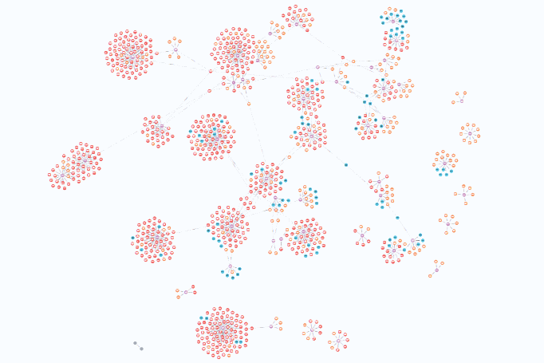
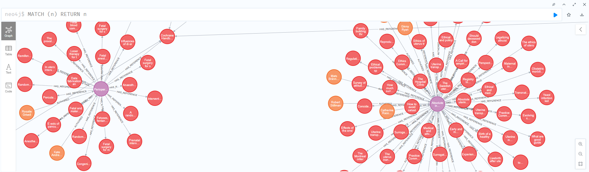
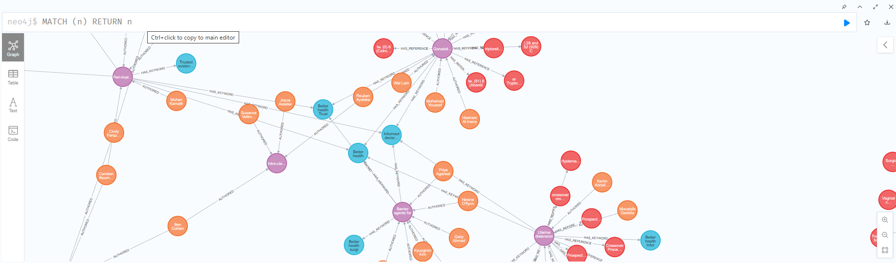

# Medical Research Knowledge Graph
- I began by building the project structure to establish a well-organized foundation for managing the workflow. Next, I extracted all JSON file names to gain insights into the topics covered by the medical papers. Following this, I undertook the cleaning and preprocessing of the dataset by extracting essential features from each medical paper and removing unnecessary spaces, tabs, and hexadecimal codes from the extracted text. This preprocessing step was systematically applied to all folders containing the dataset to ensure data consistency and quality. Finally, I designed a comprehensive knowledge graph by creating nodes for papers, authors, keywords, and references, and establishing relationships among them, such as AUTHORED, HAS_KEYWORD, and HAS_REFERENCE. This structured approach enabled the construction of a robust and interconnected knowledge graph that effectively represents the relationships and key elements within the medical research dataset.

## Analysis

Based on the provided titles, here's an analysis of the potential topics covered by these medical papers:

### General Themes:

- Fertility and Reproductive Health: Many titles reference infertility, reproductive endocrinology, ovarian reserve, and assisted reproductive technologies (ART).
Ectopic Pregnancy: Multiple titles mention retroperitoneal ectopic pregnancies and related surgical techniques.
- Systematic Reviews: Many papers are from the "Cochrane Database of Systematic Reviews," indicating a focus on summarizing and evaluating evidence on various medical interventions.
Endometriosis and Adenomyosis: Papers discuss these conditions, common causes of infertility and pelvic pain.
- Antimüllerian Hormone (AMH): Several titles highlight research into AMH, a marker of ovarian reserve.
Surgical Innovations: Some papers discuss novel surgical techniques and approaches, particularly related to reproductive health.

### Specific Topics:

- Reproductive Endocrinology and Fertility Awareness: Titles such as "A-call-to-action-to-reproductive-endocrinologists" and "Beyond-awareness – National Infertility Awareness" suggest a focus on increasing understanding and advocacy.
- Machine Learning in Reproductive Health: "An-interpretable-machine-learning-model-for-prediction" indicates computational applications in fertility.
- Diet and Fertility: "Beverage-intake-and-ovarian-reserve" explores lifestyle impacts on ovarian function.
- Rare Conditions and Innovative Treatments: Papers like "A-case-report-of-retroperitoneal-ectopic-pregnancy" and "A-combination-of-two-novel-ligation-techniques" suggest case studies and innovative methods.

### Highlighted Trends:

- Focus on Ovarian Reserve: Several studies investigate the diagnosis and implications of diminished ovarian reserve.
- Role of Hormones in Fertility: AMH and other hormonal markers are frequently analyzed.
- Technology in Reproductive Medicine: Use of automated systems for sperm identification and new surgical tools demonstrates a trend toward leveraging technology.


In summary, these papers predominantly focus on fertility, reproductive health, and innovations in diagnosis and treatment, with a strong emphasis on evidence-based practices and advanced technologies.

## Project Structure

```
medical-papers-knowledge-graph
├── src
│   ├── preprocess
│   │   ├── clean_preprocess_data.py       # Functions for cleaning and preprocessing JSON data
│   │   └── get_json_files_names.py        # Script that return all the medical papers' names
│   ├── knowledge_graph        
│   │   └── build_kg.py                    # Functions for constructing the knowledge graph
├── data
│   ├── assignementdatabse                 # Directory for raw JSON files
│   │                           
│   └── processed                          # Directory for processed JSON files
├── requirements.txt                       # Lists project dependencies
├── README.md                              # Documentation for the project
└── .gitignore                             # Specifies files to ignore in Git
```


get_json_files_names.py: this script ive us an idea about the topics of the medical papers before starting to dive in the project.


## Result





## Setup Instructions

1. Clone the repository:
   ```
   git clone <repository-url>
   cd medical-research-kg
   ```

2. Install the required dependencies:
   ```
   pip install -r requirements.txt
   ```
3. Clean and preprocess the data:
   ```
   python src/preprocess/clean_preprocess_data.py
   ```
- The cleaned data will be stored in the `data/processed` directory, ready for integration into the knowledge graph.

4. Build the knowledge graph:
   ```
   python src/knowledge_graph/build_kg.py
   ```
5. Visualise the knowledge graph:
   ```
   visit http://localhost:7474/browser/ and enter the username and password
   ```
## Overview

This project provides a framework for transforming raw medical research data into a structured format suitable for knowledge graph construction. By leveraging the capabilities of Neo4j, users can explore relationships and insights derived from medical research papers.

## Challenges encountered

Throughout the project, I encountered several challenges that required careful handling and continuous learning. The structure of the JSON files was often complex, with missing or incomplete values, which necessitated the implementation of robust error handling and data validation during the preprocessing phase. Additionally, some medical concepts were initially difficult to understand, prompting me to consult ChatGPT to gain a clearer comprehension and accurately determine the topics covered by the medical papers. On the development side, writing Cypher queries proved to be challenging at first. However, with each attempt and subsequent error resolution, I became more proficient and confident in crafting effective queries. This iterative process not only improved the efficiency of my code but also enhanced the overall quality of the knowledge graph, ensuring it accurately represents the relationships and key elements within the medical research dataset.